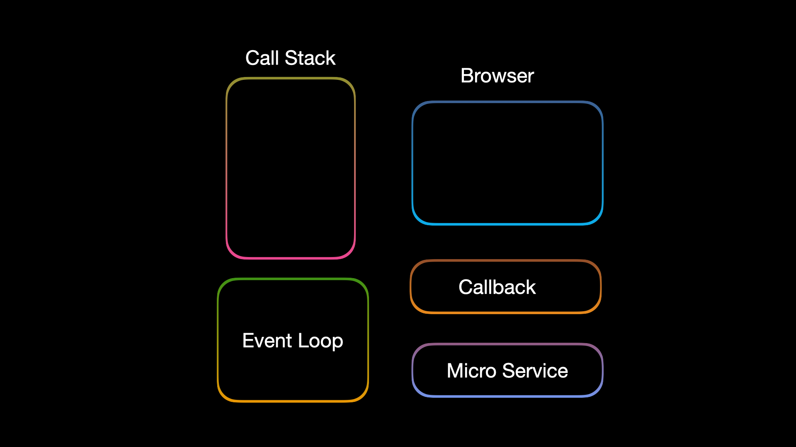
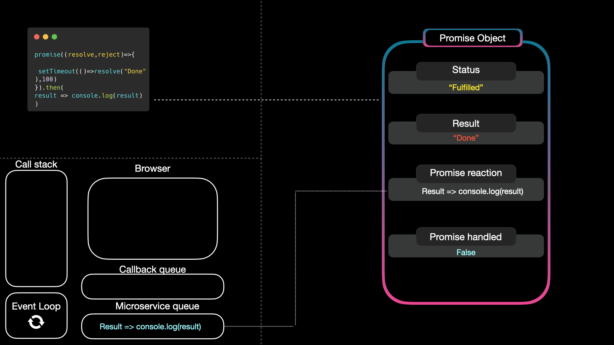

# Javascript_and_reactnative_questions_for_tech_lead
# Senior Mobile Engineer (FAANG/MANG) — Full Question Handbook (Questions Only)

This document lists the **complete 1000+ interview question bank** (questions only). Detailed answers will be linked in later sections.

---

# Section 1 — JavaScript
1. What is execution context?
- execution context: It is environment, which handles and execute variable and functions whenever scripts run.

2. Explain call stack vs heap.
- Stack is temporary memory which store varible and function instant. Heap is longer memory which hold value for longer time

3. What is lexical scope?
4. Explain closures.
- Lexical Scope: When child function access parent function's value 
- Closure: the function which uses lexical environment and hold parent even though it is executed
  
 ```javascript const count = 0;

 const add =(function(){
  count+=1
  return function(){
   count+=1
   console.log(count)
  }
 })()

 add()
 add()
 ```


5. What is hoisting?
- Hoisting means a variable can be used earlier before it declared
```javascript
 x = 5
 console.log(x)
 var x
```

6. Explain TDZ.
- Temporal Dead Zone happens in case of let and const. With var value can be initialized earlier and declared later but this not happed with let and const. 
```javascript
console.log(a) //this is temporal dead zone
let a = 10
```

7. Difference between var, let, const.
 ```javascript
 //Var: Var is global scope. And its allow re-declaration and upate the value.
 var a= 10
 var a= 20 //re-declare the value
  a = 25  // updating value

  //var allow hoisting
  a=20
  console.log(a)
  var a
 ```
 ```javascript
 //Let: Let is block-scope. And its does not allow re-declaration but allow upate the value.
 let a= 10
 let a= 20 //throw error for re-declare the value
  a = 25  // updating value

  //let does not allow hoisting. It throws reference error and this condition call temporal dead zon
  a=20
  console.log(a)
  let a
 ```
 ```javascript
 //Const: Const is block-scope. And its does not allow re-initialize the value.
 let a= 10
  a = 25  // throw error

  //Const does not allow hoisting. It throws reference error and this condition call temporal dead zon
  a=20
  console.log(a)
  const a
 ```

8. Explain this binding rules.
- Binding is associated with "This" keyword. If any function is standalone function then "this" points to global object
  ```javascript
   function hello(){
    console.log(this) //this is pointing to global object ex: window in browser
   }
   ```
- There are 4 binding types
1. Implicit binding: When a function is called as member of an object
```javascript
let blog ={
name: "Sarat",
address: "NY"
message: function(){
 console.log(`$(this.name) is blogs $(this.address)`)
}
}
blog.message(); //message is member of blog object and it is called using ".".
```
2. Explicit Binding: Use call/apply/binding

3. Use "new" keyword with function. When you call function with "new", 
- it create an empty object
- then bind "this" with object
- execute the function
- return the object
```javascript
function hello(name){
this.name = name
}
cosnt name = new hello("Ashish) 

 ```

9. call vs apply vs bind.
- this are all comes under explicit binding methods
1. Call: Call invoke the method imediately. It pass the object as first param and pass other argument by separating with ","
```javascript
function introduce(hobby,city){
  console.log(`I'm ${this.name} and my hobby is ${hoby} and I am living in ${citt}`)
}

const person = {name: "Ashish"}

introduce.call(person, "coding", "Bengaluru")
``` 
2. Apply: Apply also invoke function immediatly. It pass object as first param and pass other arguments in array form
```javascript
function introduce(hobby,city){
  console.log(`I'm ${this.name} and my hobby is ${hoby} and I am living in ${citt}`)
}

const person = {name: "Ashish"}

introduce.apply(person,["coding", "Bengaluru"])
``` 
3. Bind: Unlike other two, this will not ivoke function immediatly. but it return new function with the "this" context.
- Best usage for listener or callback
```javascript
function introduce(hobby,city){
  console.log(`I'm ${this.name} and my hobby is ${hoby} and I am living in ${citt}`)
}

const person = {name: "Ashish"}

const bindIntroduce = introduce.bind(person,"coding", "Bengaluru")

bindIntroduce()
``` 

10. Explain prototype chain.
11. What is prototypal inheritance?

Before understanding the prototype chain, will understand the prototype
Prototype: Prototype allow an object to inherit method and variable of other object
- To do that create an constructor
- attach member to that prototype
- pass it to new object
```javascript
function device(){
  this.device = device //constuctor
}

//attach member to prototype
device.prototype.systemOn = function(){
  console.log(`On the ${this.device}`)
}

new iPhone =new device("iPhone")
iPhone.systemOn()
```
Prototype chain: It allows to creat chain among the object. To do that use "_ _proto_ _"

- When an object does not have member/variable then it call parent's object using __proto__
- If parent's object does'nt have value it climb up untill prototype
- If prototype and doesnt have value then it call prototype.__proto__ which return null and close this chain 

```javascript
const person = {
  isHuman: true,
  greet: function(){
    console.log("Hello")
  }
}

const developer ={
  isDevelop: true
  __proto__: person //link developer to person
}

developer.greet()
```

12. Explain event loop.


- Callback: Callback run all synchronous code. It perform operation in LIFO.
- Browser: All the asynchronous operation perform here sucha fetch, settimeout, listener etc
- CallBack queue: the asynchronous operation which are completed does not go to callback direct. It is moved in callback queue
- Microservice queue: This is also called VIP queue. This queue handle callbacks and observers.
- Event loop: Event loop check Call back after every certain time and if no task is available in callback then it check microservice first and then callback queue if microservice queue is empty.

This is way javascript manage asynchronous using single thread


13. Microtask vs macrotask.


14. Promise lifecycle.

15. async/await internals.
- Internally async/await calls promise object under the hood. When any funtion mark as async then it means that it will definatly return promise object
- Await will pause the function untill result comes without blocking js thread

16. What is currying?
- Curring: Currying is closure in which rather than passing all param at once, first function get 1st argument and second new function get next argument
```javascript
  function multiply(a){

    return function(b){
      return a*b
    }
  }

  console.log(multiply(2)(3))
```

```javascript
 const multiply =(a)=(b)=> a*b

 let double = multiply(2) //a = 2
 let triple = multiply(4) // a = 4

 console.log(double(5)) // 10
 console.log(triple(5)) // 20
```

---

# Section 2 — React Native

1. Class vs functional components.

2. What are props?

3. What is state?

4. Lifecycle methods overview.

5. useState internals.

6. useEffect lifecycle mapping.

7. useMemo vs useCallback.

8. useRef usage scenarios.

9. Custom hooks patterns.

10. Context API usage.

11. Redux architecture basics.

12. Redux middleware purpose.

13. Redux Toolkit advantages.

14. React reconciliation process.

15. Virtual DOM concept.

16. React.memo optimization.

17. Avoiding unnecessary re‑renders.

18. FlatList vs ScrollView.

19. FlatList optimization strategies.

20. KeyExtractor importance.

21. Native modules basics.

22. TurboModules concept.

23. JSI architecture explanation.

24. Fabric renderer lifecycle.

25. Thread model in RN.

26. Yoga layout engine.

27. Hermes engine advantages.

28. Startup performance optimization.

29. Bundle size reduction techniques.

---

# Section 4 — Mobile System Design 

751. Design messaging mobile system.

752. Design push notification system.

753. Design offline sync engine.

754. Design OTA update infrastructure.

755. Design analytics ingestion pipeline.

756. Design crash reporting system.

757. Design scalable authentication flow.

758. Design payment mobile architecture.

759. Design global CDN asset pipeline.

760. Design video streaming mobile system.

761. Design global mobile feature flag infrastructure.

762. Design large‑scale authentication federation architecture.

763. Design distributed session management architecture.

764. Design real‑time presence system architecture.

765. Design scalable typing indicator architecture.

766. Design global media upload architecture.

767. Design offline media sync conflict resolution system.

768. Design scalable comments system architecture.

769. Design reactions/likes scalable architecture.

770. Design feed ranking mobile architecture.

771. Design recommendation delivery architecture.

772. Design experimentation framework mobile architecture.

773. Design push notification segmentation system.

774. Design geo‑targeted notification delivery system.

775. Design multi‑region API gateway architecture.

776. Design distributed caching architecture mobile APIs.

777. Design scalable search mobile architecture.

778. Design location‑aware search architecture.

779. Design ride‑matching real‑time architecture.

780. Design driver tracking scalable architecture.

781. Design dynamic pricing architecture mobile systems.

782. Design fraud detection mobile telemetry system.

783. Design identity verification pipeline mobile apps.

784. Design real‑time bidding notification architecture.

785. Design commerce checkout resilience architecture.

786. Design cart synchronization multi‑device architecture.

787. Design product catalog caching architecture.

788. Design payment retries reliability architecture.

789. Design distributed ledger integration mobile payments.

790. Design loyalty points global architecture.

791. Design coupon validation distributed architecture.

792. Design ticket booking high‑traffic architecture.

793. Design seat locking concurrency architecture.

794. Design waitlist scaling architecture.

795. Design calendar booking distributed architecture.

796. Design time‑zone safe scheduling architecture.

797. Design collaborative calendar editing architecture.

798. Design document attachment storage architecture.

799. Design secure enterprise messaging architecture.

800. Design enterprise compliance audit logging architecture.

801. Design mobile DLP (data loss prevention) architecture.

802. Design enterprise mobile remote policy enforcement system.

803. Design mobile zero‑trust network architecture.

804. Design cross‑device activity continuation architecture.

805. Design cross‑platform notification orchestration architecture.

806. Design multi‑channel messaging orchestration system.

807. Design SMS fallback delivery architecture.

808. Design global number masking architecture.

809. Design customer support chat escalation architecture.

810. Design chatbot hybrid human routing architecture.

811. Design voice calling scalable mobile architecture.

812. Design video conferencing scalable mobile architecture.

813. Design screen‑sharing scalable architecture.

814. Design live streaming scalable architecture.

815. Design real‑time audience engagement architecture.

816. Design in‑stream advertising insertion architecture.

817. Design ad targeting mobile delivery pipeline.

818. Design attribution tracking mobile architecture.

819. Design privacy‑safe attribution measurement architecture.

820. Design cross‑device identity resolution architecture.

821. Design data warehouse ingestion mobile telemetry pipeline.

822. Design feature store mobile ML pipeline.

823. Design model inference rollout architecture.

824. Design edge inference failover architecture.

825. Design federated learning coordination architecture.

826. Design personalized notification ranking architecture.

827. Design churn prediction integration mobile pipeline.

828. Design fraud alert delivery architecture.

829. Design emergency broadcast delivery architecture.

830. Design government alert compliance architecture.

831. Design disaster resilience mobile architecture.

832. Design offline disaster communication architecture.

833. Design mesh communication fallback architecture.

834. Design proximity‑based emergency alert architecture.

835. Design volunteer coordination mobile architecture.

836. Design donation tracking distributed architecture.

837. Design public health reporting mobile architecture.

838. Design vaccination certificate verification architecture.

839. Design cross‑border verification federation architecture.

840. Design academic exam proctoring mobile architecture.

841. Design secure remote exam monitoring architecture.

842. Design plagiarism detection integration architecture.

843. Design e‑learning video delivery architecture.

844. Design adaptive learning recommendation architecture.

845. Design classroom attendance tracking architecture.

846. Design corporate training progress tracking architecture.

847. Design certification issuance blockchain architecture.

848. Design job matching recommendation architecture.

849. Design professional networking feed architecture.

850. Design referral tracking scalable architecture.

851. Design logistics tracking real‑time architecture.

852. Design warehouse inventory scanning architecture.

853. Design delivery ETA prediction architecture.

854. Design courier route optimization mobile architecture.

855. Design fleet monitoring scalable architecture.

856. Design connected vehicle telemetry ingestion architecture.

857. Design predictive maintenance mobile analytics pipeline.

858. Design IoT device monitoring mobile architecture.

859. Design smart home orchestration mobile architecture.

860. Design smart grid consumption monitoring architecture.

861. Design EV charging discovery mobile architecture.

862. Design charging slot reservation architecture.

863. Design battery health monitoring analytics architecture.

864. Design carbon footprint tracking mobile architecture.

865. Design sustainability scoring mobile pipeline.

866. Design enterprise ESG reporting mobile pipeline.

867. Design environmental sensor crowdsource architecture.

868. Design wildlife tracking mobile architecture.

869. Design tourism discovery recommendation architecture.

870. Design itinerary planning distributed architecture.

871. Design hotel booking high‑traffic architecture.

872. Design flight search aggregation architecture.

873. Design ticket cancellation resilience architecture.

874. Design refund workflow distributed architecture.

875. Design insurance claim submission architecture.

876. Design claim fraud detection architecture.

877. Design telemedicine video consultation architecture.

878. Design health record secure sharing architecture.

879. Design wearable health monitoring ingestion architecture.

880. Design emergency ambulance dispatch architecture.

881. Design smart triage recommendation architecture.

882. Design pharmacy prescription verification architecture.

883. Design appointment booking healthcare architecture.

884. Design lab result notification delivery architecture.

885. Design chronic care remote monitoring architecture.

886. Design clinical trial participant tracking architecture.

887. Design drug supply chain traceability architecture.

888. Design medical device firmware update architecture.

889. Design insurance eligibility verification architecture.

890. Design hospital bed availability tracking architecture.

891. Design ambulance route optimization architecture.

892. Design emergency response command dashboard architecture.

893. Design disaster relief logistics mobile architecture.

894. Design evacuation route guidance architecture.

895. Design missing person alert distribution architecture.

896. Design citizen reporting mobile architecture.

897. Design urban infrastructure issue reporting architecture.

898. Design smart city traffic analytics architecture.

899. Design congestion pricing mobile architecture.

900. Design mobility‑as‑a‑service integration architecture.

---

# Section 5 — Coding Problems

901. Implement debounce.
902. Implement throttle.
903. Promise.all polyfill.
904. Promise.retry implementation.
905. LRU cache implementation.
906. Deep clone utility.
907. Memoization utility.
908. Event emitter implementation.
909. Infinite scroll pagination logic.
910. Task scheduler implementation.

(Questions continue sequentially up to Q1000 covering senior‑level JavaScript and mobile‑oriented coding patterns.)

---

# Section 6 — Leadership / Behavioral

1. Handling production outage leadership story.
2. Driving architecture migration initiative.
3. Scaling engineering team processes.
4. Mentoring senior engineers strategy.
5. Cross‑team conflict resolution example.
6. Driving platform standardization initiative.
7. Handling executive stakeholder escalations.
8. Leading incident retrospectives.
9. Balancing delivery vs quality tradeoffs.
10. Building engineering hiring frameworks.
